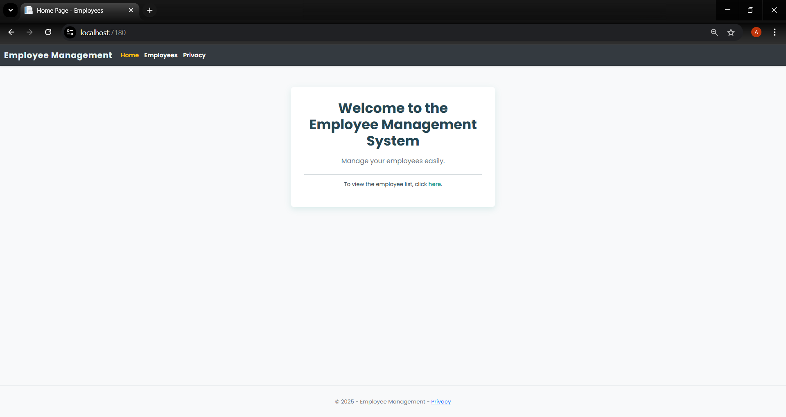
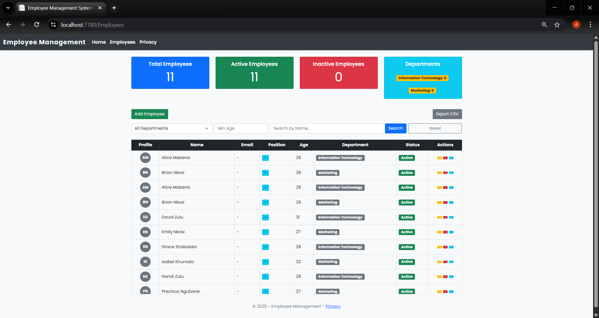
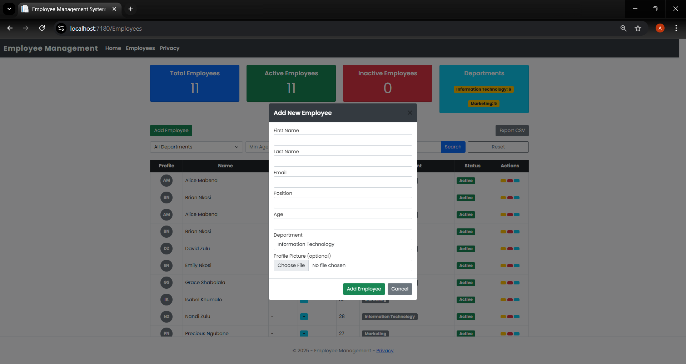

# Employee Management System

A simple Employee Management System built using ASP.NET Core MVC and Entity Framework Core.  
This project demonstrates CRUD functionality, database integration, and a clean Bootstrap-based user interface.

## Features

- Create, view, edit, and soft delete employees
- Employee listing displayed in a responsive table
- Assign employees to departments
- Manage employee email and position details
- Form validation and user-friendly UI

## Tech Stack

- ASP.NET Core MVC  
- Entity Framework Core  
- SQL Server  
- Bootstrap 5  
- C#

## Screenshots

### Home / Landing Page


### Employees Index Table


### Create Employee View


## Getting Started

Open the application in Visual studio and run the application
```bash
git clone https://github.com/your-username/your-repo-name.git
